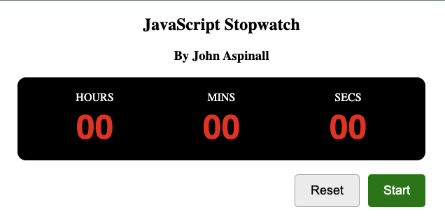

# Digital stop watch

I won't be winning any design awards with this one but it functions as it should, a digital stop watch written in Javascript in 2019-ish.  I wanted a little Javascript project to work on, on my daily, long and tedious train journies from Poulton to Manchester,  so decided to code a digital stop watch (for some reason).

I did intened to do an analogue clock face version after completing this project, but as usual, life got in the way!

## Notes

The setInterval() method was key to getting this working, and writing a bunch of functions and IF statements!  It won't win any design or coding challenge awards but was a fun little project nonetheless.

